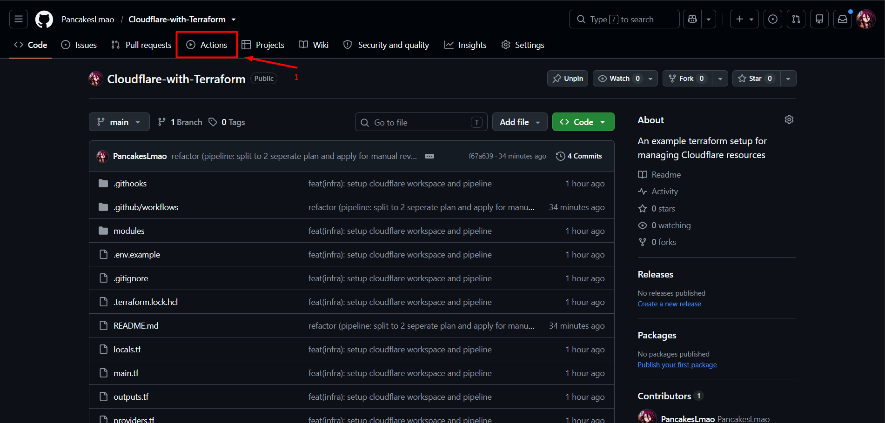
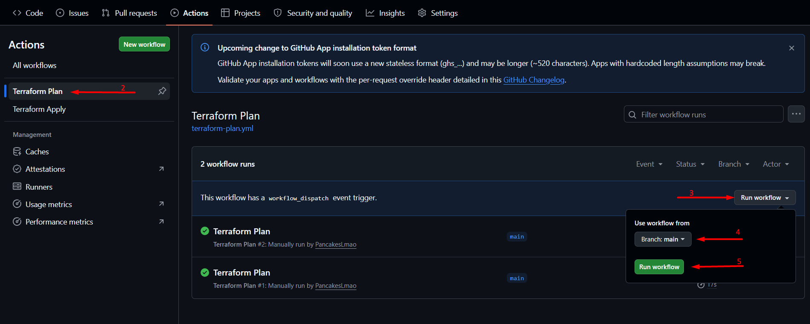
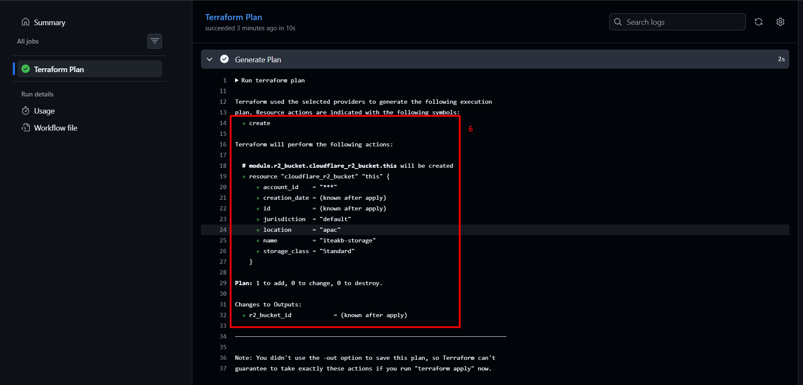
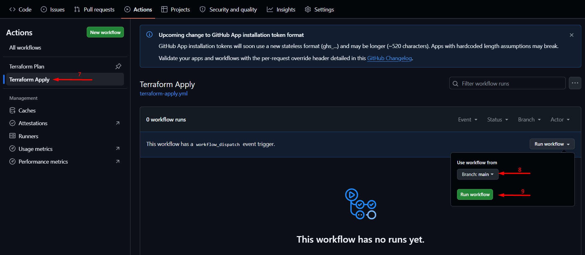
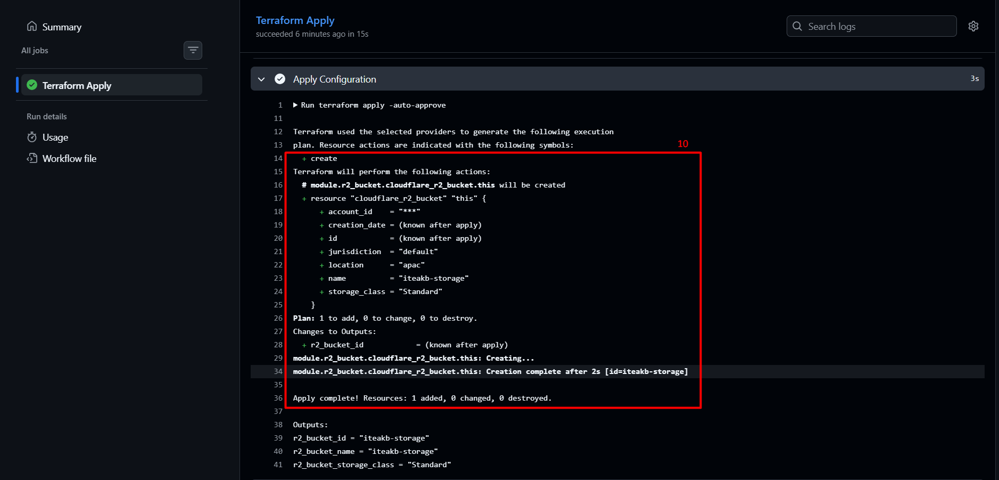

# Cloudflare Infrastructure as Code Pipeline

<p align="left">
  
  
</p>

Use this template to manage your Cloudflare infrastructure with Terraform via GitHub Actions. Pre-configured with everything you need out of the box: remote state on Cloudflare R2, local pre-commit/pre-push guardrails to catch formatting and leak errors early, and separate manual Plan & Apply CI/CD pipelines.

---

## Repository Structure

```text
/
├── .env.example              # Environment variables template (git-tracked)
├── .env                      # Local credentials & endpoints (gitignored)
├── .githooks/                # Git pre-commit & pre-push validation hooks
│   ├── pre-commit
│   └── pre-push
├── modules/                  # Reusable Terraform modules
│   ├── r2_bucket/            # Reusable Cloudflare R2 bucket module
│   └── README.md             # Module architecture guide
├── terraform.tf              # Root versions and backend configuration
├── providers.tf              # Cloudflare provider configuration
├── variables.tf              # Root input variable definitions
├── locals.tf                 # Root local values and tag definitions
├── main.tf                   # Primary Cloudflare infrastructure resources
├── outputs.tf                # Root output definitions
├── terraform.tfvars.example  # Root variable inputs template
├── README.md                 # Complete operational runbook
└── skills-lock.json          # Agent skills lockfile
```

---
## 1. Terraform Remote Backend Setup

> This Terraform setup requires the R2 state bucket to exist *before* executing `terraform init`. You have two options:
> - **Option A (This repo)**: Create an R2 bucket directly in **Cloudflare Dashboard > R2 Object Storage > Create Bucket** (e.g., `<your-state-bucket-name>`).
> - **Option B**: If you prefer creating the bucket via Terraform code, deploy it in a standalone `bootstrap/` workspace using default local state, provision the `cloudflare_r2_bucket`, and then pass the resulting bucket name to the root workspace `terraform init -backend-config="bucket=<BUCKET-NAME>"`.

### Authentication & Token Policies

Terraform interacts with Cloudflare using two distinct sets of credentials:

2.1. **Cloudflare Resource API Token** (`CLOUDFLARE_API_TOKEN`):
   - Created via **User Profile > API Tokens > Create Custom Token**.
   - > [!IMPORTANT]
     > **Include both `Read` and `Write` permissions** for each resource type you plan to provision. Terraform requires `Read` to inspect existing infrastructure before and after applying changes.
   - For example:
     - **D1**: `Read` & `Write`
     - **Workers R2 Storage**: `Read` & `Write`
   - *Note*: Avoid full administrative access (`Super Administrator` or blanket `All resources`). Practice least privilege by granting Read/Write only to resources in use. If a pipeline run returns an HTTP 403 or authentication error, inspect the failing resource step and adjust the corresponding token permission.

2.2. **R2 S3 API Token** (`AWS_ACCESS_KEY_ID` & `AWS_SECRET_ACCESS_KEY`):
   - Created via **Cloudflare Dashboard > R2 Object Storage > Manage R2 API Tokens > Create API Token**.
   - The state bucket should use a **separate, dedicated policy** with strict **"Access to selected individual R2 buckets only"**, scoped exclusively to your remote state bucket.
   - > [!IMPORTANT]
     > You **must grant `Read & Write` permissions**. Write-only tokens fail during state lock and inspection.

### Here is the summary

| Purpose | Credential | Environment Variables | Target Endpoint |
|---|---|---|---|
| **Manage Cloudflare Resources** (`cloudflare` provider) | Cloudflare API Token (Bearer) | `CLOUDFLARE_API_TOKEN` | `api.cloudflare.com` |
| **Read / Write State in R2** (`backend "s3"`) | R2 S3 Access Keys (SigV4 HMAC) | `AWS_ACCESS_KEY_ID`<br>`AWS_SECRET_ACCESS_KEY`<br>`AWS_ENDPOINT_URL_S3` | `<ACCOUNT_ID>.r2.cloudflarestorage.com` |

> [!NOTE]
> Terraform's `backend "s3"` block does not permit `var.` interpolation. Credentials are automatically read by Terraform from `AWS_ACCESS_KEY_ID` and `AWS_SECRET_ACCESS_KEY`.

Remember these credentials and save it somewhere so you can use them later

```bash
CLOUDFLARE_API_TOKEN="<your-cloudflare-api-token>"
AWS_ACCESS_KEY_ID="<your-r2-access-key-id>"
AWS_SECRET_ACCESS_KEY="<your-r2-secret-access-key>"
AWS_ENDPOINT_URL_S3="https://<your-account-id>.r2.cloudflarestorage.com"
```

### Backend Block & Compatibility Flags (`terraform.tf`)

```hcl
terraform {
  backend "s3" {
    # bucket name is provided at init via -backend-config="bucket=<STATE_BUCKET_NAME>"
    key                         = "<project-name>/terraform.tfstate"
    region                      = "auto"
    skip_credentials_validation = true
    skip_region_validation      = true
    skip_requesting_account_id  = true
    skip_s3_checksum            = true
    skip_metadata_api_check     = true
  }
}
```

#### S3 Flags Required for Cloudflare R2:
- `skip_credentials_validation = true`: Bypasses AWS STS `GetCallerIdentity` (R2 does not have an AWS STS endpoint).
- `skip_region_validation = true`: Allows Cloudflare R2's `"auto"` region instead of AWS-specific regions.
- `skip_requesting_account_id = true`: Prevents querying AWS STS for a 12-digit AWS account ID.
- `skip_metadata_api_check = true`: Disables polling the EC2 IMDS metadata service (`169.254.169.254`).
- `skip_s3_checksum = true`: Disables AWS multipart SHA256 checksums that return HTTP 400 on R2.

### Setup Remote Backend

#### 1. Load credentials into session

**PowerShell (Windows):**
```powershell
$env:AWS_ACCESS_KEY_ID="<ACCESS_KEY>"
$env:AWS_SECRET_ACCESS_KEY="<SECRET_ACCESS>"
$env:AWS_ENDPOINT_URL_S3="https://<ACCOUNT_ID>.r2.cloudflarestorage.com"
$env:CLOUDFLARE_API_TOKEN="<API_TOKEN>"
```

**Bash (Linux / macOS):**
```bash
export AWS_ACCESS_KEY_ID="<ACCESS_KEY>"
export AWS_SECRET_ACCESS_KEY="<SECRET_ACCESS>"
export AWS_ENDPOINT_URL_S3="https://<ACCOUNT_ID>.r2.cloudflarestorage.com"
export CLOUDFLARE_API_TOKEN="<API_TOKEN>"
```
---

## 2. Cloudflare Infrastructure Workspace

The root workspace manages core infrastructure resources (Workers, KV, R2, D1, Vectorize, DNS).

### Local Plan & Apply

```bash
# Copy and populate root variables
cp terraform.tfvars.example terraform.tfvars
# Edit terraform.tfvars to set your custom variable values (overrides defaults)

# terraform first init to link with it remote backend
terraform init -backend-config="bucket=your-tfstate-bucket-name"

# Format code check
terraform fmt -check

# Validate configuration syntax and schema
terraform validate

# Generate plan explicitly loading custom variable overrides
terraform plan -var-file="terraform.tfvars" -out=tfplan

# Apply approved plan (tfplan contains the evaluated variables and targeted changes)
terraform apply tfplan
```

---

## 3. Remote Backend Maintenance Commands

### Inspect Remote State
```bash
# List all resources tracked in R2 remote state
terraform state list

# Show detailed state of a specific resource
terraform state show <resource_address>

# Pull raw remote state to a local backup file (read-only)
terraform state pull > state-backup.json
```

### Force Reconfiguration / Backend Migration
```bash
# Reinitialize backend after changing backend config
terraform init -reconfigure

# Migrate state between backends
terraform init -migrate-state
```

### State Lock Management
If a pipeline or process terminates unexpectedly leaving an orphaned state lock:
```bash
# Force unlock with the Lock ID from error message
terraform force-unlock <LOCK_ID>
```

---

## 4. Git Pre-Commit / Pre-Push Hooks

This repository enforces hooks in `.githooks/`:
- **`pre-commit`**: Blocks staged secrets (`.env`, `backend.tfvars`, plaintext tokens `cfat_...`, private keys) and validates HCL syntax (`terraform validate`).
- **`pre-push`**: Enforces formatting (`terraform fmt -check`). If unformatted code is detected, push is rejected.

```bash
# Enable repository hooks (one-time setup per clone)
git config core.hooksPath .githooks
```

### Code Formatting Workflow Before Push

Feature commits can be committed freely without formatting interruptions. Before pushing, format all code and create a dedicated formatting commit following Conventional Commits (`style:`):

```bash
# 1. Automatically format all Terraform files recursively
terraform fmt -recursive

# 2. Stage formatted changes
git add -u '*.tf'

# 3. Commit with standard formatting convention
git commit -m "style: format terraform code"

# 4. Push changes
git push
```

---

## 5. GitHub Actions CI/CD Pipelines

Split into two distinct manual workflows (`workflow_dispatch`):

1. **Plan Pipeline** ([`.github/workflows/terraform-plan.yml`](file:///.github/workflows/terraform-plan.yml)):
   - Runs on **any branch**.
   - Executes `terraform init` and `terraform plan`.
   - Output displays in live GitHub Actions execution log for inspection.
   - Stops immediately after plan generation. No state modifications.

2. **Apply Pipeline** ([`.github/workflows/terraform-apply.yml`](file:///.github/workflows/terraform-apply.yml)):
   - Constrained to **`main` branch only** (`if: github.ref == 'refs/heads/main'`) so create a Pull Request to main when apply new change.
   - Executes `terraform init` and `terraform apply -auto-approve`.
   - Provisions resources and updates remote R2 state.

### Required GitHub Secrets & Variables

#### 1. Repository Secrets
Go to **Repository > Settings > Secrets and variables > Actions > Secrets tab > New repository secret**:

| Secret Name | Value Source | Purpose |
|---|---|---|
| `CLOUDFLARE_API_TOKEN` | `.env` line 1 | Authenticates Cloudflare provider (Workers, R2, KV, D1) |
| `CLOUDFLARE_ACCOUNT_ID` | Cloudflare Dashboard | Account ID (also auto-constructs R2 S3 endpoint) |
| `AWS_ACCESS_KEY_ID` | `.env` line 2 | R2 S3 HMAC key for reading/writing remote state |
| `AWS_SECRET_ACCESS_KEY` | `.env` line 3 | R2 S3 HMAC secret for reading/writing remote state |

#### 2. Repository Variables
Go to **Repository > Settings > Secrets and variables > Actions > Variables tab > New repository variable**:

| Variable Name | Value Source | Purpose |
|---|---|---|
| `TF_STATE_BUCKET` | Cloudflare R2 | Name of the R2 bucket holding Terraform remote state |

*(Note: `AWS_ENDPOINT_URL_S3` is automatically constructed by each workflow as `https://<ACCOUNT_ID>.r2.cloudflarestorage.com`).*

---

## 6. Walkthrough

Step-by-step guide for planning and deploying infrastructure changes:

### Phase 1: Planning Infrastructure Changes

#### Step 1: Open the repository on GitHub and click the **Actions** tab.



#### Steps 2–5: Trigger the Plan Pipeline
- **Step 2**: Select **Terraform Plan** under *Workflows* in the left navigation menu.
- **Step 3**: Click the **Run workflow** dropdown on the right.
- **Step 4**: Select the branch you want to run this pipeline on.
- **Step 5**: Click the green **Run workflow** button to launch the run.



#### Step 6: Review Plan Output
Click into the workflow run and expand the **Generate Plan** step to view the complete Terraform plan output in real time.



---

### Phase 2: Applying Infrastructure Changes

#### Steps 7–9: Trigger the Apply Pipeline
- **Step 7**: After reviewing and validating the plan, navigate back to the **Actions** tab and select the **Terraform Apply** workflow.
- **Step 8**: Select the target branch (`main`).
- **Step 9**: Click the green **Run workflow** button.



#### Step 10: Verify Deployment Output
Expand the **Apply Configuration** step to confirm all Cloudflare resources have been provisioned successfully.



> [!TIP]
> **Troubleshooting Permissions**: If a pipeline step returns an HTTP `403 Authentication error`, inspect the error output to identify the failing resource, and adjust the corresponding Read/Write permissions on your Cloudflare API token. Avoid full privilege administrative access.
